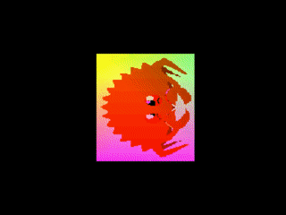

# psx-sdk-rs

<p align="center">
    
</p>

This is a basic SDK to run custom Rust code on a PlayStation 1. It works with
Rust nightly version equal to or later than `2022-10-01`. Use
[`rustup`](https://www.rust-lang.org/) to install the rust toolchain as follows.

```
rustup update nightly
rustup component add rust-src --toolchain nightly
```

## Installing cargo-psx

`cargo-psx` is an optional wrapper for cargo (similar to [cargo-psp](https://github.com/overdrivenpotato/rust-psp/))
that sets commonly required flags and arguments and copies the target JSON to
the crate's target directory. Basically this lets you just run `cargo psx run`
instead of

```
RUSTFLAGS="-Ccodegen-units=1                               \
    -Clink-arg=-Tpsexe.ld -Clink-arg=--oformat=binary"     \
    cargo run +psx -Zbuild-std=core                        \
    -Zbuild-std-features=compiler-builtins-mem             \
    --target /path/to/mipsel-sony-psx.json
```

which has the minimum number of flags required to create and run an exe.

To install:

```
cd cargo-psx
cargo install --path .
```

To uninstall:

```
cargo uninstall cargo-psx
```

For more options:

```
cargo psx --help
```
    
## Usage

The `examples` directory has some demos which have been tested with the SCPH7001
NA BIOS in [mednafen](https://mednafen.github.io/),
[pcsx-redux](https://github.com/grumpycoders/pcsx-redux) and/or
[duckstation](https://github.com/stenzek/duckstation). Other BIOS
versions/regions may work but have not been tested. To try out a demo first
check that you have the emulator in `examples/$DEMO/.cargo/config.toml`
installed, then run `cargo psx run` from its directory.

To manually select the executable in your emulator, first build with `cargo psx
build` then open the .exe in `/path/to/crate/target/mipsel-sony-psx/release/`.
To use `cargo psx run` with other emulators change the
[runner](https://doc.rust-lang.org/cargo/reference/config.html#target) for the
`mipsel-sony-psx` target. To package the executable into an ISO (e.g. to use the
CD-ROM filesystem) use [mkpsxiso](https://github.com/Lameguy64/mkpsxiso) or
similar.

### Mednafen

Mednafen tends to just work with the following `.cargo/config.toml`. Getting
stdout may require setting `psx.dbg_level` in `mednafen.cfg` to at least 2. When
loading ISOs there doesn't seem to be a fastboot (skip BIOS) option, so ISOs
must be licensed properly since the BIOS validates some checksums.

```
[target.mipsel-sony-psx]
runner = "mednafen"
```

### PCSX-Redux

PCSX-Redux works with the following `.cargo/config.toml`. Note that `-loadexe`
must be the last option since `cargo psx run` passes the executable filename at
the end. See [this page](https://pcsx-redux.consoledev.net/cli_flags/) for more
command line options.

```
[target.mipsel-sony-psx]
runner = ["pcsx-redux", "-stdout", "-run", "-loadexe"]
```

To run an ISO from the command line use `pcsx-redux -stdout -run -iso $ISO_FILENAME`.

### DuckStation

DuckStation works and is extremely useful for debugging, but it doesn't work
with `cargo psx run`. The issue is that the command passes the runner a relative
path to the executable, but DuckStation only accepts absolute paths on the
command line. To use DuckStation, build with `cargo psx build` then open the
executable manually. To run an ISO use `duckstation-qt -fastboot /full/path/to/$ISO_FILENAME`.

## Program template

To create a new program just use `cargo init` and add `psx = "*"` or
`psx = { path = "/path/to/psx/crate" }` to `Cargo.toml` under `[dependencies]`.
Then replace `src/main.rs` with the following template

```rust
#![no_std]
#![no_main]

// This can be any import from the `psx` crate
// but there must be at least one.
use psx;

#[no_mangle]
fn main() {
}
```

[`no_std`](https://docs.rust-embedded.org/embedonomicon/smallest-no-std.html#what-does-no_std-mean)
is required to link the `core` crate instead of `std`. `no_main` tells rustc to
make no assumption about the [program's entry point](https://docs.rust-embedded.org/embedonomicon/smallest-no-std.html#the-code).
The attribute on `main` is required since the entry point defined in the `psx`
crate expects to call an [`unmangled function`](https://docs.rust-embedded.org/book/interoperability/rust-with-c.html#no_mangle).
The `main` function should not return, but the return type can be either omitted
(i.e. `()`) or `!`.

## Documentation

See [docs.rs](https://docs.rs/psx/latest/psx/) for documentation. To regenerate documentation for the latest version of `psx`:

```
cd psx
cargo doc --target mipsel-unknown-linux-gnu
```

Then open `target/mipsel-unknown-linux-gnu/doc/psx/index.html` in a browser.

For documentation on PlayStation internals see the
[nocash specs](https://psx-spx.consoledev.net/).

## Testing

Use the following to run the tests in the psx crate.

```
cd psx
cargo psx test
```
